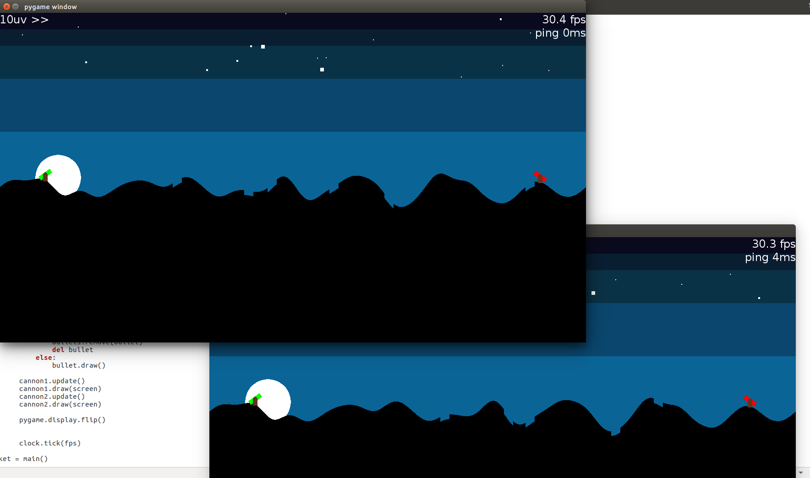

# BangBang
Implementation of classic game BangBang on Python using TCP sockets for online/multiplater matches.

## How to build it
Construido para versão Python3.5.2+.
É recomendado que se utilize uma "virtualenv" para construir o projeto. Para verificar se ele já está instalado execute o seguinte comando:
```
$ python3 -m virtualenv --version
```

Caso não funcione, instale o virtualenv na máquina:
```
$ sudo apt-get install python3-pip
$ sudo pip3 install virtualenv
```

Então execute o seguinte para criar a virtualenv:
```
$ python3 -m virtualenv pyenv3
```

Para ativar o ambiente virtual execute:
```
$ source pyenv3/bin/activate
```

Com o ambiente virtual ativo, execute o seguinte comando para instalar todas as depêndencias:
```
(pyenv3) $ python -m pip install -r requirements.txt
```


## How to run it
Certifique-se que o ambiente virtual esta ativo executando:
```
$ source pyenv3/bin/activate
```

### How to play alone
```
(pyenv3) $ python main.py
```

### How to Host
```
(pyenv3) $ python main.py host
```

### How to Join
```
(pyenv3) $ python main.py join [HOST_ADDRESS]
```

## How to play
O objetivo do jogo é acertar o canhão do adversário com um tiro de seu canhão.
Para jogar utilize os direcionais (flecha pra cima e pra baixo) do teclado para mirar o canhão.
Segure espaço para regular a força do tiro e solte para disparar a bola de canhão

## Preview
<table><tr><td></td><td></td></tr><tr><td colspan="2"></td></tr></table>
